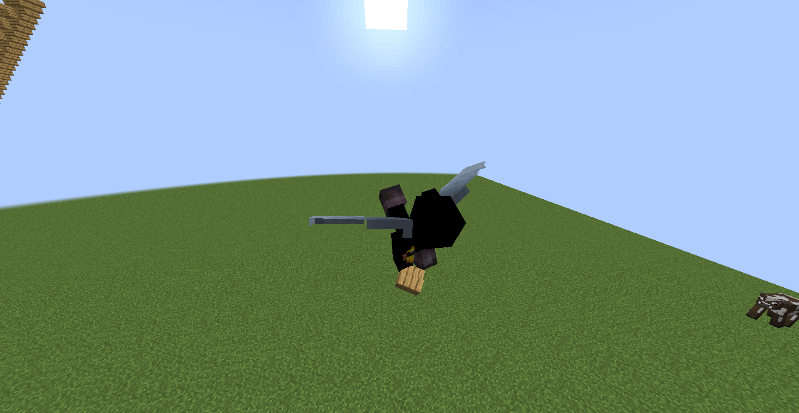

# SafeElytra



SafeElytra is a minecraft plugin that automatically enabled your elytra when
falling to prevent fall damage.

## Permissions:

- safeelytra.use

## Building:

```sh
git clone https://github.com/KaspianDev/SafeElytra.git
```

```sh
./gradlew build
```

Artifact will be located in build/libs.
